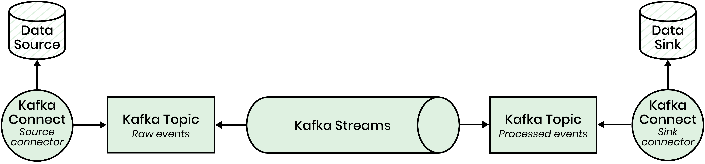
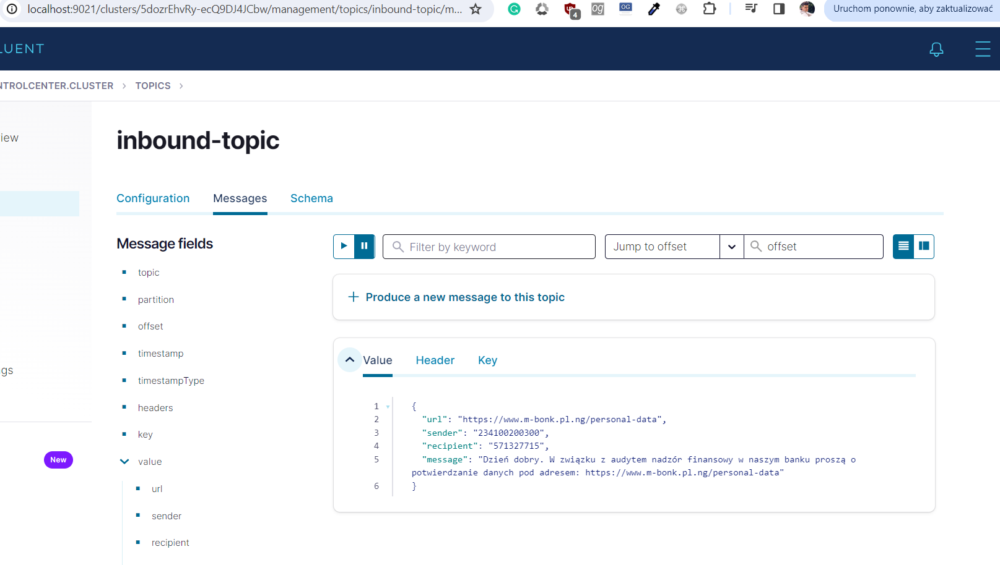
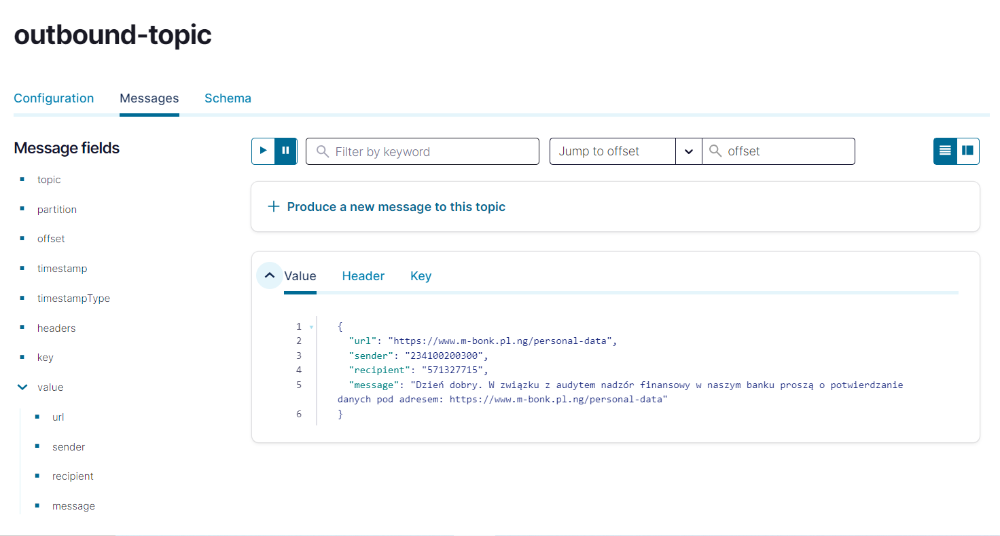
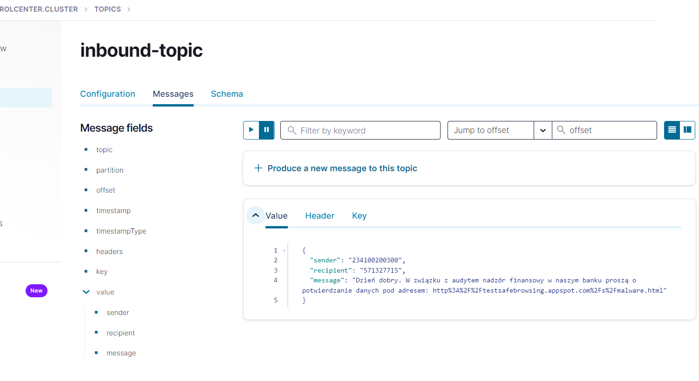

<h1>Readme</h1>
Aplikacja mogła być napisana w "czystej" Javie (terminal app; albo inny język JVM - Scala ok) - wtedy konteneryzacja byłaby prosta, a zaprzęganie Spring Boota tutaj to mógł być overkill (jednak ciągnąłem rozwiązanie dalej). Taka aplikacja mogłaby łączyć się z Kafką i wykorzystywać 2 topics - tak jak tutaj ale byłaby znacznie prostsza. :) 
<h1>Rozwiązanie (prawdopodobnie) właściwe</h1>

Connector do bazy danych z JSONami (Oracle?)-> inbound_topic -> Stream -> outbound_topic->to DB?

<h2>Usprawienienia/pomysły - w zleżności od kontekstu:</h2>
<ul>
    <li>Użycie EAP evaluateUri (żeby mieć np. heurystyki z tej końcówki; search endpoint z stabilnych wersji API to chyba tylko przeszukuje pewnie jakąś "bazę" URL-ów - tak sądzę) + zmienna przy uruchamianiu na klucze z emaila</li>
    <li>Cachowanie url-ów które już raz zostały wykryte jako phising celem uniknięcia dodatkowych kosztów - Redis (?)</li>
    <li>Przemyślenie jak zaimplementować funkcjonalność START/STOP - może mechanizm Kafki, "pukanie" do bazy relacyjnej może być wolne</li>
    <li>Apache Avro do serializacji/deserializacji - rejestracja na topicu generowanie etc., może samo schema na konkretny topic</li>
    <li>Wkładanie na topici mogłoby odbywać się jakimś cronem z basha z pominięciem REST-a</li>
    <li>Dopisanie testów jednoskowych (również kafka-streams-test-utils; ConsumerRecordFactory#create wallclock etc.)</li>
    <li>Język Scala - actor model (Akka)</li>
    <li>Analiza https://nussknacker.io/ celem zrozumienia prawdziwej architektury używanej wewnątrz organizacji https://github.com/TouK/nussknacker</li>
    <li>Nawet jeśli zachowujemy aplikację w Spring Boot (raczej nie jest konieczna) to powinna zostać skonteneryzowana w odpowiedni sposób i mogłaby wraz z Kafka i resztą być uruchamiana poprzez odpowiedni docker-compose</li>
    <li>Automatyzacja wypychania obrazów do Docker Huba przy commicie na mastera; otagowanie image i bodajże docker push po zalogowaniu - częściowy Dockerfile w repozytorium</li>
    <li>Jeśli nadal Spring Boot to użycie properties na stałe tekstowe, jeśli nie spring boot to też można przechowywać w jednym pliku</li>
    <li>Nie każdy SMS musi mieć jeden URL bądź posiadać go - powinno znaleźć się to w kodzie obsługa tego przypadku - skanowanie wszystkich URLów bądź pomijanie
    takich które go nie posiadają</li>
    <li>W zależności od kontekstu możliwe jest zachowanie stanu przetwarzania strumieniowego dla przyszłych celów</li>
</ul>

<h1>START/STOP</h1>
Przesłanie message przez endpoint send z recipient - 1234 (pewnie możnaby skonfigurować ten numer)
<h1>Uruchomienie</h1>
1. Clone aplikacji i zaimportowanie do edytora - ja użyłem InteliJ  
2. docker-compose up -d   
3. Uruchomienie skryptu SQL dla kontenera (psql --user user --password \changeit) postgresa tworzącego tabele users, odpowiednią schema (skrypt SQL)
4. Zaciągnięcie zależnośći Mavenowych  
5. Ustawienie zmiennej środowiskowej GOOGLE_APPLICATION_CREDENTIALS wskazującej na ścieżkę na JSON-a z emaila z zadaniem  
6. Zainstalowanie Postmana bądź innego klienta (można też uruchomić scheduler w spring boocie).  
7. Uruchomienie aplikacji Spring Bootowej.  
8. Wysłanie pewnego zestawu "wiadomości" poprzez końcówkę REST POST http://localhost:8082/send wraz z casem START/STOP.  
9. Podejrzenie w control panelu po przejściu Streama outbound-messages (control panel zgodnie z docker-compose jest pod http://localhost:9021/) - bądź uruchomienie końcówki (do dopisania), która ściąga takie wiadomości - końcówka to też nie jest dobre rozwiązanie, takie wiadomości mogłyby być konsumowane przez inny kod który wysyła te wiadomości  
Można również wejść do kafkowego kontenera - docker exec -ti kafka bash ... i użyć kafka-console-consumer --bootstrap-server ... --topic ...

W kontekście aplikacji z terminala "ETL-terminal" widzę jako zaczytanie jakiegoś zbioru wiadomości - np. z pliku(bądź baza NoSql?). Potem włożenie ich na topic inbound na którym nasłuchuje stream (Stream bo potencjalnie większe możliwości rozbudowy, wielowątkowość - grupowanie, agregacja etc.), który filtruje wiadomości i odkłada na inny topic (bądź sink connectorem gdzieś - mongodb?).

<h1>Architektura</h1>
W systemie zarysowania architekturę warstwową (multi-layered) jeśli chodzi o samą aplikację. Należałoby dodatkowo ją "przeczyścić".

<h1>Przykład użycia</h1>
<h2>Inbound-topic - przychodząca wiadomość</h2>
Wiadomość na topicu inbound: 

Wiadomość na topic outbound - jest bezpieczna mimo, że dla użytkownika włączone jest filtrowanie  

Teraz ThreatType.MALWARE jest włączone (Phising to nie Malware)   - na topicu outbound nie będzie wiadomości

